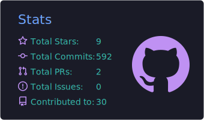

# 👨🏻‍💻 Olá, Sou Roberth!

**`Engenheiro de Software - Backend Java`**

Engenheiro de Software focado em Backend Java, Spring Boot e arquiteturas de microsserviços. Trago uma perspectiva única para a tecnologia, combinando 7 anos de experiência em Gestão Comercial — onde desenvolvi liderança, visão de negócio e foco no cliente — com a paixão por construir soluções de software robustas, escaláveis e de alta performance.

Sou apaixonado por boas práticas como Clean Code, testes automatizados (JUnit/Mockito) e metodologias ágeis que entregam valor real, como Scrum e Kanban.

  
  
  
  

 

  
  
  
  
  
  
  
  
  
  

 

  

